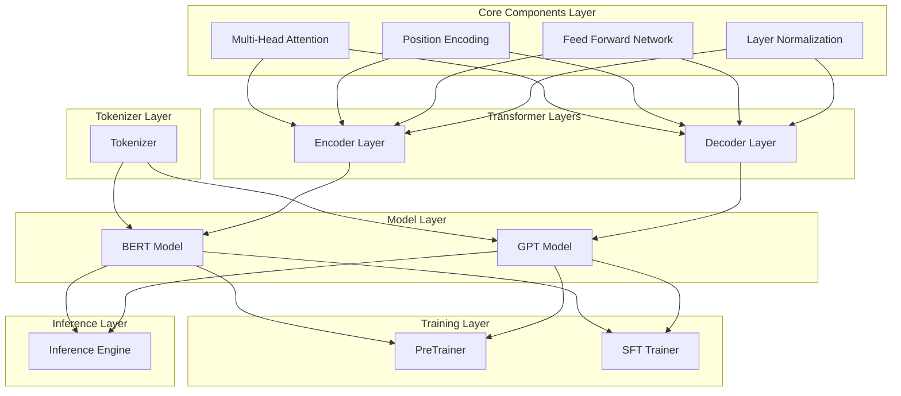
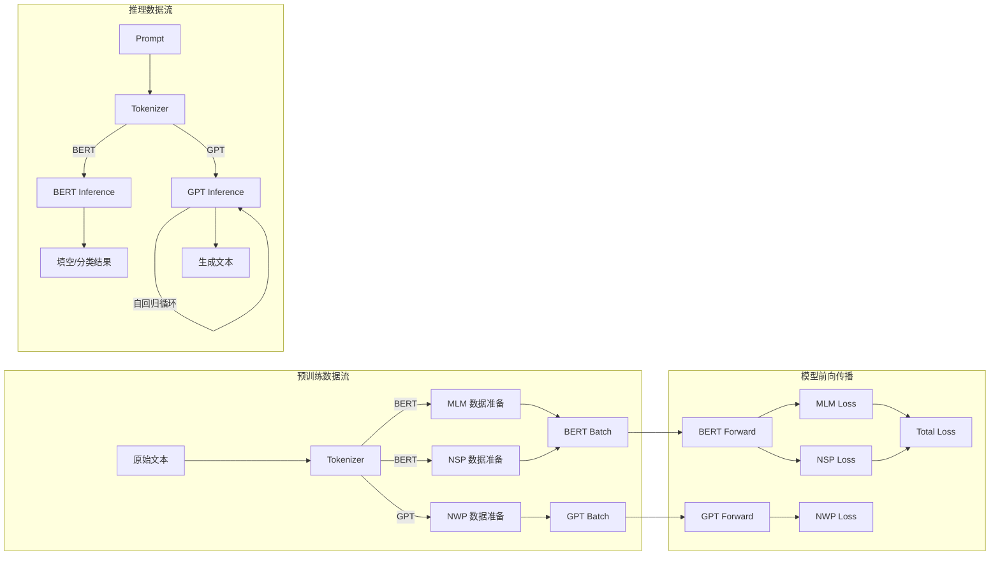

# 技术设计文档

## 概述

本设计文档描述从零实现 BERT 和 GPT 两大 LLM 范式的技术方案。项目采用模块化架构，将 Transformer 核心组件、模型架构、训练流程和推理引擎分层设计，确保代码可复用、可测试、易于理解。

### 设计目标

1. **教育性**：代码结构清晰，便于理解 Transformer 原理
2. **模块化**：组件独立可测试，支持灵活组合
3. **完整性**：覆盖预训练、微调、推理全流程
4. **可扩展性**：支持不同规模的模型配置

### 技术选型

- **语言**：Python 3.8+
- **深度学习框架**：PyTorch 2.0+
- **数学计算**：NumPy
- **配置管理**：dataclasses
- **日志**：Python logging

## 架构

### 系统架构图



### 目录结构

```
bert_gpt_from_scratch/
├── __init__.py
├── config.py                 # 模型配置类
├── tokenizer/
│   ├── __init__.py
│   └── simple_tokenizer.py   # 简易 Tokenizer 实现
├── core/
│   ├── __init__.py
│   ├── attention.py          # Multi-Head Attention
│   ├── position.py           # Position Encoding
│   ├── feedforward.py        # Feed Forward Network
│   └── layers.py             # Encoder/Decoder Layer
├── models/
│   ├── __init__.py
│   ├── bert.py               # BERT 模型
│   └── gpt.py                # GPT 模型
├── training/
│   ├── __init__.py
│   ├── pretrain.py           # 预训练 Trainer
│   ├── sft.py                # SFT Trainer
│   └── utils.py              # 训练工具函数
├── inference/
│   ├── __init__.py
│   └── engine.py             # 推理引擎
└── tests/
    ├── __init__.py
    ├── test_attention.py
    ├── test_position.py
    ├── test_feedforward.py
    ├── test_layers.py
    ├── test_bert.py
    ├── test_gpt.py
    ├── test_tokenizer.py
    └── test_inference.py
```

## 组件与接口

### 1. 配置模块 (config.py)

```python
@dataclass
class TransformerConfig:
    """Transformer 基础配置"""
    vocab_size: int = 30000
    d_model: int = 768
    num_heads: int = 12
    num_layers: int = 12
    d_ff: int = 3072
    max_seq_len: int = 512
    dropout_rate: float = 0.1
    
@dataclass
class BERTConfig(TransformerConfig):
    """BERT 专用配置"""
    num_segments: int = 2  # Segment Embedding 数量
    
@dataclass
class GPTConfig(TransformerConfig):
    """GPT 专用配置"""
    tie_weights: bool = True  # 是否绑定 embedding 和 lm_head 权重
```

### 2. 核心组件接口

#### 2.1 Scaled Dot-Product Attention

```python
def scaled_dot_product_attention(
    query: torch.Tensor,      # (batch, heads, seq_len, d_k)
    key: torch.Tensor,        # (batch, heads, seq_len, d_k)
    value: torch.Tensor,      # (batch, heads, seq_len, d_v)
    mask: Optional[torch.Tensor] = None,  # (batch, 1, 1, seq_len) or (batch, 1, seq_len, seq_len)
    dropout: Optional[nn.Dropout] = None
) -> Tuple[torch.Tensor, torch.Tensor]:
    """
    计算 Scaled Dot-Product Attention
    
    Returns:
        output: (batch, heads, seq_len, d_v)
        attention_weights: (batch, heads, seq_len, seq_len)
    """
```

#### 2.2 Multi-Head Attention

```python
class MultiHeadAttention(nn.Module):
    def __init__(
        self,
        d_model: int,
        num_heads: int,
        dropout_rate: float = 0.1
    ):
        """
        多头注意力机制
        
        Args:
            d_model: 模型维度
            num_heads: 注意力头数量
            dropout_rate: Dropout 比率
        """
    
    def forward(
        self,
        query: torch.Tensor,      # (batch, seq_len, d_model)
        key: torch.Tensor,        # (batch, seq_len, d_model)
        value: torch.Tensor,      # (batch, seq_len, d_model)
        mask: Optional[torch.Tensor] = None
    ) -> torch.Tensor:
        """
        Returns:
            output: (batch, seq_len, d_model)
        """
```

#### 2.3 Position Encoding

```python
class SinusoidalPositionEncoding(nn.Module):
    def __init__(self, d_model: int, max_seq_len: int = 5000):
        """正弦余弦位置编码（不可学习）"""
    
    def forward(self, x: torch.Tensor) -> torch.Tensor:
        """
        Args:
            x: (batch, seq_len, d_model)
        Returns:
            x + position_encoding: (batch, seq_len, d_model)
        """

class LearnablePositionEmbedding(nn.Module):
    def __init__(self, d_model: int, max_seq_len: int):
        """可学习位置嵌入"""
    
    def forward(self, x: torch.Tensor) -> torch.Tensor:
        """
        Args:
            x: (batch, seq_len, d_model)
        Returns:
            x + position_embedding: (batch, seq_len, d_model)
        """
```

#### 2.4 Feed Forward Network

```python
class FeedForwardNetwork(nn.Module):
    def __init__(
        self,
        d_model: int,
        d_ff: int,
        dropout_rate: float = 0.1
    ):
        """
        前馈神经网络
        
        结构: Linear(d_model, d_ff) -> GELU -> Dropout -> Linear(d_ff, d_model)
        """
    
    def forward(self, x: torch.Tensor) -> torch.Tensor:
        """
        Args:
            x: (batch, seq_len, d_model)
        Returns:
            output: (batch, seq_len, d_model)
        """
```

### 3. Transformer 层接口

#### 3.1 Encoder Layer

```python
class EncoderLayer(nn.Module):
    def __init__(
        self,
        d_model: int,
        num_heads: int,
        d_ff: int,
        dropout_rate: float = 0.1
    ):
        """
        Transformer Encoder 层
        
        结构:
        1. Multi-Head Self-Attention + Residual + LayerNorm
        2. Feed Forward Network + Residual + LayerNorm
        """
    
    def forward(
        self,
        x: torch.Tensor,                    # (batch, seq_len, d_model)
        padding_mask: Optional[torch.Tensor] = None  # (batch, seq_len)
    ) -> torch.Tensor:
        """
        Returns:
            output: (batch, seq_len, d_model)
        """
```

#### 3.2 Decoder Layer

```python
class DecoderLayer(nn.Module):
    def __init__(
        self,
        d_model: int,
        num_heads: int,
        d_ff: int,
        dropout_rate: float = 0.1
    ):
        """
        Transformer Decoder 层（GPT 风格，仅自注意力）
        
        结构:
        1. Masked Multi-Head Self-Attention + Residual + LayerNorm
        2. Feed Forward Network + Residual + LayerNorm
        """
    
    def forward(
        self,
        x: torch.Tensor,                    # (batch, seq_len, d_model)
        padding_mask: Optional[torch.Tensor] = None  # (batch, seq_len)
    ) -> torch.Tensor:
        """
        自动应用 causal mask
        
        Returns:
            output: (batch, seq_len, d_model)
        """
```

### 4. 模型接口

#### 4.1 BERT Model

```python
class BERTModel(nn.Module):
    def __init__(self, config: BERTConfig):
        """
        BERT 模型（Encoder-Only）
        
        组件:
        - Token Embedding
        - Segment Embedding
        - Position Embedding (Learnable)
        - N x Encoder Layer
        - MLM Head
        - NSP Head
        """
    
    def forward(
        self,
        input_ids: torch.Tensor,           # (batch, seq_len)
        segment_ids: torch.Tensor,         # (batch, seq_len)
        attention_mask: Optional[torch.Tensor] = None  # (batch, seq_len)
    ) -> Dict[str, torch.Tensor]:
        """
        Returns:
            {
                'hidden_states': (batch, seq_len, d_model),
                'mlm_logits': (batch, seq_len, vocab_size),
                'nsp_logits': (batch, 2)
            }
        """
    
    def get_mlm_head(self) -> nn.Module:
        """返回 MLM 预测头"""
    
    def get_nsp_head(self) -> nn.Module:
        """返回 NSP 预测头"""
```

#### 4.2 GPT Model

```python
class GPTModel(nn.Module):
    def __init__(self, config: GPTConfig):
        """
        GPT 模型（Decoder-Only）
        
        组件:
        - Token Embedding
        - Position Embedding (Learnable)
        - N x Decoder Layer
        - LM Head (可选权重绑定)
        """
    
    def forward(
        self,
        input_ids: torch.Tensor,           # (batch, seq_len)
        attention_mask: Optional[torch.Tensor] = None  # (batch, seq_len)
    ) -> Dict[str, torch.Tensor]:
        """
        Returns:
            {
                'hidden_states': (batch, seq_len, d_model),
                'logits': (batch, seq_len, vocab_size)
            }
        """
    
    def get_lm_head(self) -> nn.Module:
        """返回语言模型头"""
```

### 5. 训练接口

#### 5.1 BERT PreTrainer

```python
class BERTPreTrainer:
    def __init__(
        self,
        model: BERTModel,
        config: TrainingConfig,
        tokenizer: Tokenizer
    ):
        """BERT 预训练器"""
    
    def prepare_mlm_data(
        self,
        input_ids: torch.Tensor,
        mask_prob: float = 0.15
    ) -> Tuple[torch.Tensor, torch.Tensor, torch.Tensor]:
        """
        准备 MLM 训练数据
        
        Returns:
            masked_input_ids: 掩码后的输入
            mlm_labels: MLM 标签（非掩码位置为 -100）
            mlm_mask: 掩码位置的布尔张量
        """
    
    def prepare_nsp_data(
        self,
        sentences: List[str]
    ) -> Tuple[torch.Tensor, torch.Tensor, torch.Tensor]:
        """
        准备 NSP 训练数据
        
        Returns:
            input_ids: 拼接后的句子对
            segment_ids: 段落标识
            nsp_labels: NSP 标签（0=真实下一句，1=随机句子）
        """
    
    def train_step(
        self,
        batch: Dict[str, torch.Tensor]
    ) -> Dict[str, float]:
        """
        单步训练
        
        Returns:
            {'mlm_loss': float, 'nsp_loss': float, 'total_loss': float}
        """
    
    def train(self, dataloader: DataLoader, num_epochs: int) -> None:
        """完整训练循环"""
```

#### 5.2 GPT PreTrainer

```python
class GPTPreTrainer:
    def __init__(
        self,
        model: GPTModel,
        config: TrainingConfig,
        tokenizer: Tokenizer
    ):
        """GPT 预训练器"""
    
    def prepare_nwp_data(
        self,
        input_ids: torch.Tensor
    ) -> Tuple[torch.Tensor, torch.Tensor]:
        """
        准备 NWP 训练数据
        
        Returns:
            input_ids: 输入序列
            labels: 目标序列（右移一位）
        """
    
    def train_step(
        self,
        batch: Dict[str, torch.Tensor]
    ) -> Dict[str, float]:
        """
        单步训练
        
        Returns:
            {'loss': float}
        """
    
    def train(self, dataloader: DataLoader, num_epochs: int) -> None:
        """完整训练循环"""
```

#### 5.3 SFT Trainer

```python
class SFTTrainer:
    def __init__(
        self,
        model: Union[BERTModel, GPTModel],
        config: SFTConfig,
        tokenizer: Tokenizer
    ):
        """监督微调训练器"""
    
    def load_pretrained(self, checkpoint_path: str) -> None:
        """加载预训练检查点"""
    
    def freeze_layers(self, num_layers: int) -> None:
        """冻结前 N 层参数"""
    
    def train_classification(
        self,
        dataloader: DataLoader,
        num_classes: int
    ) -> None:
        """BERT 文本分类微调"""
    
    def train_instruction(
        self,
        dataloader: DataLoader
    ) -> None:
        """GPT 指令微调（仅对 response 计算损失）"""
```

### 6. 推理接口

```python
class InferenceEngine:
    def __init__(self, device: str = 'cuda'):
        """推理引擎"""
    
    def load_model(
        self,
        model_type: str,  # 'bert' or 'gpt'
        checkpoint_path: str,
        config: TransformerConfig
    ) -> None:
        """加载模型检查点"""
    
    # BERT 推理方法
    def bert_fill_mask(
        self,
        text: str,
        top_k: int = 5
    ) -> List[Tuple[str, float]]:
        """
        MLM 填空推理
        
        Returns:
            [(predicted_token, probability), ...]
        """
    
    def bert_classify(
        self,
        text: str,
        num_classes: int
    ) -> Tuple[int, torch.Tensor]:
        """
        文本分类推理
        
        Returns:
            (predicted_class, class_probabilities)
        """
    
    # GPT 推理方法
    def gpt_generate(
        self,
        prompt: str,
        max_gen_len: int = 100,
        temperature: float = 1.0,
        top_k: Optional[int] = None,
        top_p: Optional[float] = None,
        decoding_strategy: str = 'greedy'  # 'greedy', 'top_k', 'top_p'
    ) -> str:
        """
        自回归文本生成
        
        Args:
            prompt: 输入提示
            max_gen_len: 最大生成长度
            temperature: 温度参数
            top_k: Top-K 采样的 K 值
            top_p: Top-P（Nucleus）采样的 P 值
            decoding_strategy: 解码策略
        
        Returns:
            生成的完整文本
        """
```

### 7. Tokenizer 接口

```python
class SimpleTokenizer:
    def __init__(self, vocab: Dict[str, int]):
        """
        简易 Tokenizer
        
        特殊 token:
        - [PAD]: 0
        - [UNK]: 1
        - [CLS]: 2
        - [SEP]: 3
        - [MASK]: 4
        - [BOS]: 5
        - [EOS]: 6
        """
    
    def encode(
        self,
        text: str,
        add_special_tokens: bool = True,
        max_length: Optional[int] = None,
        padding: bool = False
    ) -> List[int]:
        """
        将文本编码为 token ID 序列
        
        Args:
            text: 输入文本
            add_special_tokens: 是否添加特殊 token
            max_length: 最大长度（截断）
            padding: 是否填充到 max_length
        
        Returns:
            token_ids: token ID 列表
        """
    
    def decode(
        self,
        token_ids: List[int],
        skip_special_tokens: bool = True
    ) -> str:
        """
        将 token ID 序列解码为文本
        
        Args:
            token_ids: token ID 列表
            skip_special_tokens: 是否跳过特殊 token
        
        Returns:
            text: 解码后的文本
        """
    
    @property
    def vocab_size(self) -> int:
        """词表大小"""
    
    @property
    def pad_token_id(self) -> int:
        """[PAD] token ID"""
    
    @property
    def mask_token_id(self) -> int:
        """[MASK] token ID"""
    
    @property
    def cls_token_id(self) -> int:
        """[CLS] token ID"""
    
    @property
    def sep_token_id(self) -> int:
        """[SEP] token ID"""
    
    @property
    def bos_token_id(self) -> int:
        """[BOS] token ID"""
    
    @property
    def eos_token_id(self) -> int:
        """[EOS] token ID"""
```

## 数据模型

### 1. 训练配置

```python
@dataclass
class TrainingConfig:
    """训练配置"""
    batch_size: int = 32
    learning_rate: float = 1e-4
    num_epochs: int = 10
    warmup_steps: int = 10000
    weight_decay: float = 0.01
    max_grad_norm: float = 1.0
    save_steps: int = 1000
    log_steps: int = 100
    checkpoint_dir: str = './checkpoints'

@dataclass
class SFTConfig(TrainingConfig):
    """SFT 配置"""
    warmup_ratio: float = 0.1
    freeze_layers: int = 0  # 冻结的层数
    num_classes: int = 2    # 分类任务的类别数
```

### 2. 数据批次格式

```python
# BERT 预训练批次
BERTPretrainBatch = TypedDict('BERTPretrainBatch', {
    'input_ids': torch.Tensor,      # (batch, seq_len)
    'segment_ids': torch.Tensor,    # (batch, seq_len)
    'attention_mask': torch.Tensor, # (batch, seq_len)
    'mlm_labels': torch.Tensor,     # (batch, seq_len), -100 for non-masked
    'nsp_labels': torch.Tensor,     # (batch,)
})

# GPT 预训练批次
GPTPretrainBatch = TypedDict('GPTPretrainBatch', {
    'input_ids': torch.Tensor,      # (batch, seq_len)
    'attention_mask': torch.Tensor, # (batch, seq_len)
    'labels': torch.Tensor,         # (batch, seq_len), -100 for padding
})

# SFT 分类批次
ClassificationBatch = TypedDict('ClassificationBatch', {
    'input_ids': torch.Tensor,      # (batch, seq_len)
    'attention_mask': torch.Tensor, # (batch, seq_len)
    'labels': torch.Tensor,         # (batch,)
})

# SFT 指令微调批次
InstructionBatch = TypedDict('InstructionBatch', {
    'input_ids': torch.Tensor,      # (batch, seq_len)
    'attention_mask': torch.Tensor, # (batch, seq_len)
    'labels': torch.Tensor,         # (batch, seq_len), -100 for instruction part
})
```

### 3. 检查点格式

```python
Checkpoint = TypedDict('Checkpoint', {
    'model_state_dict': Dict[str, torch.Tensor],
    'optimizer_state_dict': Dict[str, Any],
    'config': TransformerConfig,
    'epoch': int,
    'global_step': int,
    'loss': float,
})
```

### 4. 数据流图



