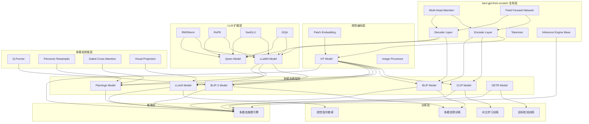
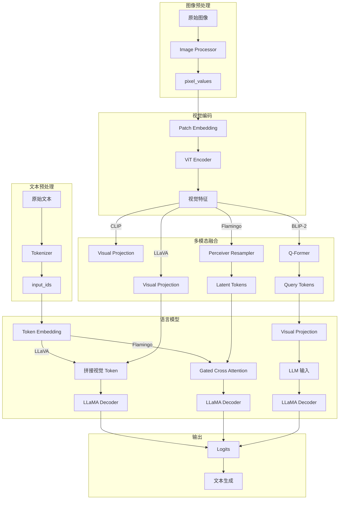

# 技术设计文档

## 概述

本设计文档描述从零实现多模态大模型和计算机视觉模型的技术方案。项目涵盖 CV 基础模型（ViT、DETR）、多模态对齐模型（CLIP、BLIP/BLIP-2）、以及多模态大语言模型（Flamingo、LLaMA、LLaVA、Qwen 系列）。项目复用 bert-gpt-from-scratch 中的 Transformer 核心组件，采用模块化架构设计，确保代码可复用、可测试、易于理解。

### 设计目标

1. **教育性**：代码结构清晰，便于理解多模态模型原理
2. **模块化**：组件独立可测试，支持灵活组合
3. **完整性**：覆盖预训练、微调、推理全流程
4. **可扩展性**：支持不同规模的模型配置
5. **复用性**：最大化复用 bert-gpt-from-scratch 的核心组件

### 技术选型

- **语言**：Python 3.8+
- **深度学习框架**：PyTorch 2.0+
- **数学计算**：NumPy
- **图像处理**：PIL/Pillow
- **配置管理**：dataclasses
- **日志**：Python logging
- **优化算法**：scipy（匈牙利匹配）

## 架构

### 系统架构图



### 目录结构

```
multimodal_models_from_scratch/
├── __init__.py
├── config.py                     # 模型配置类
├── vision/
│   ├── __init__.py
│   ├── patch_embedding.py        # Patch Embedding 实现
│   ├── vit.py                    # ViT 模型
│   ├── image_processor.py        # 图像预处理
│   └── backbone.py               # CNN Backbone (ResNet)
├── llm/
│   ├── __init__.py
│   ├── rmsnorm.py                # RMSNorm 归一化
│   ├── rope.py                   # RoPE 旋转位置编码
│   ├── swiglu.py                 # SwiGLU 激活函数
│   ├── gqa.py                    # Grouped Query Attention
│   ├── llama.py                  # LLaMA 模型
│   └── qwen.py                   # Qwen 模型
├── multimodal/
│   ├── __init__.py
│   ├── clip.py                   # CLIP 模型
│   ├── blip.py                   # BLIP 模型
│   ├── blip2.py                  # BLIP-2 模型
│   ├── qformer.py                # Q-Former 模块
│   ├── flamingo.py               # Flamingo 模型
│   ├── perceiver.py              # Perceiver Resampler
│   ├── gated_cross_attention.py  # 门控交叉注意力
│   ├── llava.py                  # LLaVA 模型
│   └── visual_projection.py      # 视觉投影层
├── detection/
│   ├── __init__.py
│   ├── detr.py                   # DETR 模型
│   ├── hungarian.py              # 匈牙利匹配
│   └── losses.py                 # 检测损失函数
├── training/
│   ├── __init__.py
│   ├── contrastive.py            # 对比学习训练
│   ├── multimodal_pretrain.py    # 多模态预训练
│   ├── visual_instruction.py     # 视觉指令微调
│   ├── detection_train.py        # 目标检测训练
│   └── utils.py                  # 训练工具函数
├── inference/
│   ├── __init__.py
│   └── multimodal_engine.py      # 多模态推理引擎
└── tests/
    ├── __init__.py
    ├── test_patch_embedding.py
    ├── test_vit.py
    ├── test_llama.py
    ├── test_qwen.py
    ├── test_clip.py
    ├── test_blip.py
    ├── test_blip2.py
    ├── test_flamingo.py
    ├── test_llava.py
    ├── test_detr.py
    └── test_inference.py
```

## 组件与接口

### 1. 配置模块 (config.py)

```python
from dataclasses import dataclass
from typing import Optional, Tuple

# 复用 bert-gpt-from-scratch 的基础配置
from bert_gpt_from_scratch.config import TransformerConfig

@dataclass
class VisionConfig:
    """视觉编码器配置"""
    image_size: int = 224
    patch_size: int = 16
    in_channels: int = 3
    d_model: int = 768
    num_heads: int = 12
    num_layers: int = 12
    d_ff: int = 3072
    dropout_rate: float = 0.1
    num_classes: int = 1000  # 图像分类类别数

@dataclass
class LLaMAConfig:
    """LLaMA 模型配置"""
    vocab_size: int = 32000
    d_model: int = 4096
    num_heads: int = 32
    num_kv_heads: int = 8  # GQA 的 KV 头数
    num_layers: int = 32
    d_ff: int = 11008
    max_seq_len: int = 4096
    dropout_rate: float = 0.0
    rope_theta: float = 10000.0
    tie_weights: bool = False

@dataclass
class QwenConfig(LLaMAConfig):
    """Qwen 模型配置"""
    use_sliding_window: bool = False
    sliding_window_size: int = 4096
    rope_scaling: Optional[dict] = None  # NTK-aware 插值配置

@dataclass
class CLIPConfig:
    """CLIP 模型配置"""
    vision_config: VisionConfig = None
    text_config: TransformerConfig = None
    projection_dim: int = 512
    temperature: float = 0.07

@dataclass
class BLIPConfig:
    """BLIP 模型配置"""
    vision_config: VisionConfig = None
    text_config: TransformerConfig = None
    projection_dim: int = 256

@dataclass
class BLIP2Config:
    """BLIP-2 模型配置"""
    vision_config: VisionConfig = None
    qformer_config: TransformerConfig = None
    llm_config: LLaMAConfig = None
    num_query_tokens: int = 32
    projection_dim: int = 768

@dataclass
class FlamingoConfig:
    """Flamingo 模型配置"""
    vision_config: VisionConfig = None
    llm_config: LLaMAConfig = None
    num_latents: int = 64
    cross_attention_freq: int = 4  # 每隔多少层插入交叉注意力

@dataclass
class LLaVAConfig:
    """LLaVA 模型配置"""
    vision_config: VisionConfig = None
    llm_config: LLaMAConfig = None
    projection_type: str = 'mlp'  # 'linear' or 'mlp'
    freeze_vision: bool = True
    freeze_llm: bool = False

@dataclass
class DETRConfig:
    """DETR 模型配置"""
    num_classes: int = 91  # COCO 类别数
    num_queries: int = 100
    d_model: int = 256
    num_heads: int = 8
    num_encoder_layers: int = 6
    num_decoder_layers: int = 6
    d_ff: int = 2048
    dropout_rate: float = 0.1
```

### 2. 视觉编码组件

#### 2.1 Patch Embedding

```python
class PatchEmbedding(nn.Module):
    def __init__(
        self,
        image_size: int = 224,
        patch_size: int = 16,
        in_channels: int = 3,
        d_model: int = 768
    ):
        """
        图像块嵌入模块
        
        Args:
            image_size: 输入图像尺寸
            patch_size: patch 大小
            in_channels: 输入通道数
            d_model: 嵌入维度
        """
        # num_patches = (image_size // patch_size) ** 2
        # 使用 Conv2d 实现 patch 分割和线性投影
        # 可学习的 [CLS] token: (1, 1, d_model)
        # 可学习的位置嵌入: (1, num_patches + 1, d_model)
    
    def forward(self, x: torch.Tensor) -> torch.Tensor:
        """
        Args:
            x: (batch, in_channels, H, W)
        Returns:
            embeddings: (batch, num_patches + 1, d_model)
        """
```

#### 2.2 ViT Model

```python
class ViTModel(nn.Module):
    def __init__(self, config: VisionConfig):
        """
        Vision Transformer 模型
        
        组件:
        - Patch Embedding
        - N x Encoder Layer (复用 bert-gpt-from-scratch)
        - Layer Normalization
        - Classification Head (可选)
        """
    
    def forward(
        self,
        pixel_values: torch.Tensor,  # (batch, 3, H, W)
        output_hidden_states: bool = False
    ) -> Dict[str, torch.Tensor]:
        """
        Returns:
            {
                'last_hidden_state': (batch, num_patches + 1, d_model),
                'pooler_output': (batch, d_model),  # [CLS] token
                'logits': (batch, num_classes),  # 如果有分类头
                'hidden_states': tuple  # 如果 output_hidden_states=True
            }
        """
    
    def get_image_features(self, pixel_values: torch.Tensor) -> torch.Tensor:
        """
        获取图像特征（不含 [CLS] token）
        
        Returns:
            features: (batch, num_patches, d_model)
        """
```

#### 2.3 Image Processor

```python
class ImageProcessor:
    def __init__(
        self,
        image_size: int = 224,
        mean: Tuple[float, ...] = (0.485, 0.456, 0.406),
        std: Tuple[float, ...] = (0.229, 0.224, 0.225)
    ):
        """
        图像预处理器
        
        Args:
            image_size: 目标图像尺寸
            mean: ImageNet 均值
            std: ImageNet 标准差
        """
    
    def __call__(
        self,
        images: Union[str, Image.Image, np.ndarray, torch.Tensor, List],
        return_tensors: str = 'pt'
    ) -> Dict[str, torch.Tensor]:
        """
        预处理图像
        
        Args:
            images: 单张或多张图像（支持文件路径、PIL Image、numpy array、torch Tensor）
            return_tensors: 返回格式 ('pt' for PyTorch)
        
        Returns:
            {'pixel_values': (batch, 3, H, W)}
        """
```

### 3. LLM 扩展组件

#### 3.1 RMSNorm

```python
class RMSNorm(nn.Module):
    def __init__(self, d_model: int, eps: float = 1e-6):
        """
        Root Mean Square Layer Normalization
        
        公式: x * weight / sqrt(mean(x^2) + eps)
        
        Args:
            d_model: 输入维度
            eps: 数值稳定性参数
        """
    
    def forward(self, x: torch.Tensor) -> torch.Tensor:
        """
        Args:
            x: (batch, seq_len, d_model)
        Returns:
            normalized: (batch, seq_len, d_model)
        """
```

#### 3.2 RoPE (Rotary Position Embedding)

```python
class RotaryPositionEmbedding(nn.Module):
    def __init__(
        self,
        d_model: int,
        max_seq_len: int = 4096,
        theta: float = 10000.0
    ):
        """
        旋转位置编码
        
        Args:
            d_model: 模型维度
            max_seq_len: 最大序列长度
            theta: 基础频率
        """
        # 预计算 cos 和 sin 缓存
    
    def forward(
        self,
        q: torch.Tensor,  # (batch, num_heads, seq_len, head_dim)
        k: torch.Tensor,  # (batch, num_heads, seq_len, head_dim)
        position_ids: Optional[torch.Tensor] = None
    ) -> Tuple[torch.Tensor, torch.Tensor]:
        """
        对 Q 和 K 应用旋转位置编码
        
        Returns:
            rotated_q: (batch, num_heads, seq_len, head_dim)
            rotated_k: (batch, num_heads, seq_len, head_dim)
        """
    
    def apply_rotary_emb(
        self,
        x: torch.Tensor,
        cos: torch.Tensor,
        sin: torch.Tensor
    ) -> torch.Tensor:
        """应用旋转变换"""
```

#### 3.3 SwiGLU

```python
class SwiGLU(nn.Module):
    def __init__(self, d_model: int, d_ff: int, dropout_rate: float = 0.0):
        """
        SwiGLU 激活函数的前馈网络
        
        结构: Linear(d_model, d_ff) * Swish(Linear(d_model, d_ff)) -> Linear(d_ff, d_model)
        
        Args:
            d_model: 输入/输出维度
            d_ff: 中间层维度
            dropout_rate: Dropout 比率
        """
    
    def forward(self, x: torch.Tensor) -> torch.Tensor:
        """
        Args:
            x: (batch, seq_len, d_model)
        Returns:
            output: (batch, seq_len, d_model)
        """
```

#### 3.4 Grouped Query Attention (GQA)

```python
class GroupedQueryAttention(nn.Module):
    def __init__(
        self,
        d_model: int,
        num_heads: int,
        num_kv_heads: int,
        dropout_rate: float = 0.0
    ):
        """
        分组查询注意力
        
        Args:
            d_model: 模型维度
            num_heads: Query 头数
            num_kv_heads: Key/Value 头数 (num_heads 必须能被 num_kv_heads 整除)
            dropout_rate: Dropout 比率
        """
        # num_groups = num_heads // num_kv_heads
    
    def forward(
        self,
        hidden_states: torch.Tensor,  # (batch, seq_len, d_model)
        attention_mask: Optional[torch.Tensor] = None,
        position_embeddings: Optional[Tuple[torch.Tensor, torch.Tensor]] = None,  # (cos, sin)
        past_key_value: Optional[Tuple[torch.Tensor, torch.Tensor]] = None,
        use_cache: bool = False
    ) -> Tuple[torch.Tensor, Optional[Tuple[torch.Tensor, torch.Tensor]]]:
        """
        Returns:
            output: (batch, seq_len, d_model)
            past_key_value: ((batch, num_kv_heads, seq_len, head_dim), ...) if use_cache
        """
```

#### 3.5 LLaMA Model

```python
class LLaMADecoderLayer(nn.Module):
    def __init__(self, config: LLaMAConfig, layer_idx: int):
        """
        LLaMA Decoder 层
        
        结构 (Pre-Norm):
        1. RMSNorm -> GQA + Residual
        2. RMSNorm -> SwiGLU + Residual
        """
    
    def forward(
        self,
        hidden_states: torch.Tensor,
        attention_mask: Optional[torch.Tensor] = None,
        position_embeddings: Optional[Tuple[torch.Tensor, torch.Tensor]] = None,
        past_key_value: Optional[Tuple[torch.Tensor, torch.Tensor]] = None,
        use_cache: bool = False
    ) -> Tuple[torch.Tensor, Optional[Tuple[torch.Tensor, torch.Tensor]]]:
        """
        Returns:
            hidden_states: (batch, seq_len, d_model)
            past_key_value: KV cache if use_cache
        """

class LLaMAModel(nn.Module):
    def __init__(self, config: LLaMAConfig):
        """
        LLaMA 模型
        
        组件:
        - Token Embedding
        - RoPE
        - N x LLaMADecoderLayer
        - RMSNorm
        - LM Head (可选权重绑定)
        """
    
    def forward(
        self,
        input_ids: torch.Tensor,  # (batch, seq_len)
        attention_mask: Optional[torch.Tensor] = None,
        past_key_values: Optional[List[Tuple[torch.Tensor, torch.Tensor]]] = None,
        use_cache: bool = False,
        output_hidden_states: bool = False
    ) -> Dict[str, Any]:
        """
        Returns:
            {
                'logits': (batch, seq_len, vocab_size),
                'hidden_states': (batch, seq_len, d_model),
                'past_key_values': List[Tuple] if use_cache
            }
        """
    
    def get_input_embeddings(self) -> nn.Embedding:
        """返回输入嵌入层"""
    
    def prepare_inputs_for_generation(
        self,
        input_ids: torch.Tensor,
        past_key_values: Optional[List] = None,
        **kwargs
    ) -> Dict[str, Any]:
        """准备生成所需的输入"""
```

#### 3.6 Qwen Model

```python
class QwenModel(LLaMAModel):
    def __init__(self, config: QwenConfig):
        """
        Qwen 模型（继承 LLaMA 架构）
        
        扩展特性:
        - NTK-aware RoPE 插值
        - Sliding Window Attention (可选)
        """
    
    def _apply_ntk_scaling(self, seq_len: int) -> None:
        """应用 NTK-aware 动态缩放"""
```

### 4. 多模态桥接组件

#### 4.1 Q-Former

```python
class QFormerLayer(nn.Module):
    def __init__(self, config: TransformerConfig):
        """
        Q-Former 层
        
        结构:
        1. Self-Attention (查询向量之间)
        2. Cross-Attention (查询向量关注视觉特征)
        3. Feed Forward Network
        """
    
    def forward(
        self,
        query_embeds: torch.Tensor,      # (batch, num_queries, d_model)
        encoder_hidden_states: torch.Tensor,  # (batch, num_patches, d_model)
        encoder_attention_mask: Optional[torch.Tensor] = None
    ) -> torch.Tensor:
        """
        Returns:
            query_output: (batch, num_queries, d_model)
        """

class QFormer(nn.Module):
    def __init__(
        self,
        config: TransformerConfig,
        num_query_tokens: int = 32
    ):
        """
        Querying Transformer
        
        组件:
        - 可学习的查询向量: (1, num_query_tokens, d_model)
        - N x QFormerLayer
        """
    
    def forward(
        self,
        encoder_hidden_states: torch.Tensor,  # (batch, num_patches, d_model)
        encoder_attention_mask: Optional[torch.Tensor] = None
    ) -> torch.Tensor:
        """
        Returns:
            query_output: (batch, num_query_tokens, d_model)
        """
```

#### 4.2 Perceiver Resampler

```python
class PerceiverResampler(nn.Module):
    def __init__(
        self,
        d_model: int,
        num_latents: int = 64,
        num_heads: int = 8,
        num_layers: int = 6
    ):
        """
        Perceiver Resampler (Flamingo)
        
        将可变长度的视觉特征压缩为固定数量的 latent 向量
        
        组件:
        - 可学习的 latent 向量: (1, num_latents, d_model)
        - N x (Cross-Attention + Self-Attention + FFN)
        """
    
    def forward(
        self,
        visual_features: torch.Tensor  # (batch, num_patches, d_model)
    ) -> torch.Tensor:
        """
        Returns:
            latents: (batch, num_latents, d_model)
        """
```

#### 4.3 Gated Cross Attention

```python
class GatedCrossAttentionLayer(nn.Module):
    def __init__(self, d_model: int, num_heads: int):
        """
        门控交叉注意力层 (Flamingo)
        
        结构:
        - Cross-Attention: 文本 token 关注视觉 token
        - 门控参数: tanh(alpha)，初始化为 0
        
        输出: hidden_states + tanh(alpha) * cross_attention_output
        """
    
    def forward(
        self,
        hidden_states: torch.Tensor,      # (batch, seq_len, d_model)
        visual_features: torch.Tensor,    # (batch, num_visual_tokens, d_model)
        visual_attention_mask: Optional[torch.Tensor] = None
    ) -> torch.Tensor:
        """
        Returns:
            output: (batch, seq_len, d_model)
        """
```

#### 4.4 Visual Projection

```python
class VisualProjection(nn.Module):
    def __init__(
        self,
        vision_dim: int,
        llm_dim: int,
        projection_type: str = 'mlp'  # 'linear' or 'mlp'
    ):
        """
        视觉投影层
        
        将视觉特征映射到 LLM 的嵌入空间
        
        Args:
            vision_dim: 视觉特征维度
            llm_dim: LLM 嵌入维度
            projection_type: 投影类型
                - 'linear': 单层线性投影
                - 'mlp': 两层 MLP (Linear -> GELU -> Linear)
        """
    
    def forward(self, visual_features: torch.Tensor) -> torch.Tensor:
        """
        Args:
            visual_features: (batch, num_tokens, vision_dim)
        Returns:
            projected: (batch, num_tokens, llm_dim)
        """
```

### 5. 多模态模型接口

#### 5.1 CLIP Model

```python
class CLIPModel(nn.Module):
    def __init__(self, config: CLIPConfig):
        """
        CLIP 模型
        
        组件:
        - Vision Encoder (ViT)
        - Text Encoder (Transformer Encoder，复用 bert-gpt-from-scratch)
        - Visual Projection
        - Text Projection
        - 可学习的温度参数
        """
    
    def encode_image(self, pixel_values: torch.Tensor) -> torch.Tensor:
        """
        编码图像
        
        Returns:
            image_embeds: (batch, projection_dim)，L2 归一化后
        """
    
    def encode_text(self, input_ids: torch.Tensor) -> torch.Tensor:
        """
        编码文本
        
        Returns:
            text_embeds: (batch, projection_dim)，L2 归一化后
        """
    
    def forward(
        self,
        pixel_values: torch.Tensor,  # (batch, 3, H, W)
        input_ids: torch.Tensor      # (batch, seq_len)
    ) -> Dict[str, torch.Tensor]:
        """
        Returns:
            {
                'image_embeds': (batch, projection_dim),
                'text_embeds': (batch, projection_dim),
                'logits_per_image': (batch, batch),  # 图像到文本相似度
                'logits_per_text': (batch, batch),   # 文本到图像相似度
                'temperature': scalar
            }
        """
    
    def zero_shot_classify(
        self,
        pixel_values: torch.Tensor,
        text_labels: List[str],
        tokenizer: Any
    ) -> Tuple[torch.Tensor, torch.Tensor]:
        """
        零样本图像分类
        
        Returns:
            predicted_labels: (batch,)
            probabilities: (batch, num_labels)
        """
```

#### 5.2 BLIP Model

```python
class BLIPModel(nn.Module):
    def __init__(self, config: BLIPConfig):
        """
        BLIP 模型
        
        组件:
        - Vision Encoder (ViT)
        - Text Encoder (带 Cross-Attention)
        - Text Decoder (带 Cross-Attention)
        - ITC Head (对比学习)
        - ITM Head (图文匹配)
        """
    
    def forward_itc(
        self,
        pixel_values: torch.Tensor,
        input_ids: torch.Tensor
    ) -> Dict[str, torch.Tensor]:
        """
        Image-Text Contrastive 前向传播
        
        Returns:
            {
                'image_embeds': (batch, projection_dim),
                'text_embeds': (batch, projection_dim),
                'logits_per_image': (batch, batch),
                'logits_per_text': (batch, batch)
            }
        """
    
    def forward_itm(
        self,
        pixel_values: torch.Tensor,
        input_ids: torch.Tensor
    ) -> torch.Tensor:
        """
        Image-Text Matching 前向传播
        
        Returns:
            itm_logits: (batch, 2)  # 匹配/不匹配
        """
    
    def forward_itg(
        self,
        pixel_values: torch.Tensor,
        input_ids: torch.Tensor,
        labels: torch.Tensor
    ) -> torch.Tensor:
        """
        Image-grounded Text Generation 前向传播
        
        Returns:
            lm_loss: scalar
        """
    
    def generate_caption(
        self,
        pixel_values: torch.Tensor,
        max_length: int = 30,
        **generation_kwargs
    ) -> List[str]:
        """生成图像描述"""
    
    def visual_question_answering(
        self,
        pixel_values: torch.Tensor,
        questions: List[str],
        **generation_kwargs
    ) -> List[str]:
        """视觉问答"""
```

#### 5.3 BLIP-2 Model

```python
class BLIP2Model(nn.Module):
    def __init__(self, config: BLIP2Config):
        """
        BLIP-2 模型
        
        组件:
        - 冻结的 Vision Encoder (ViT)
        - Q-Former
        - Visual Projection
        - 冻结的 LLM (LLaMA)
        """
    
    def forward_stage1(
        self,
        pixel_values: torch.Tensor,
        input_ids: torch.Tensor
    ) -> Dict[str, torch.Tensor]:
        """
        第一阶段训练前向传播 (训练 Q-Former)
        
        Returns:
            {
                'itc_loss': scalar,
                'itm_loss': scalar,
                'itg_loss': scalar
            }
        """
    
    def forward_stage2(
        self,
        pixel_values: torch.Tensor,
        input_ids: torch.Tensor,
        labels: torch.Tensor
    ) -> torch.Tensor:
        """
        第二阶段训练前向传播 (训练 Visual Projection)
        
        Returns:
            lm_loss: scalar
        """
    
    def generate(
        self,
        pixel_values: torch.Tensor,
        prompt: Optional[str] = None,
        max_length: int = 50,
        **generation_kwargs
    ) -> List[str]:
        """视觉语言生成"""
```

#### 5.4 Flamingo Model

```python
class FlamingoModel(nn.Module):
    def __init__(self, config: FlamingoConfig):
        """
        Flamingo 模型
        
        组件:
        - 冻结的 Vision Encoder (ViT)
        - Perceiver Resampler
        - 冻结的 LLM (LLaMA)，每隔 cross_attention_freq 层插入 Gated Cross Attention
        """
    
    def forward(
        self,
        pixel_values: torch.Tensor,      # (batch, num_images, 3, H, W)
        input_ids: torch.Tensor,         # (batch, seq_len)
        image_positions: torch.Tensor,   # (batch, num_images) 图像在文本中的位置
        labels: Optional[torch.Tensor] = None
    ) -> Dict[str, torch.Tensor]:
        """
        Returns:
            {
                'logits': (batch, seq_len, vocab_size),
                'loss': scalar if labels provided
            }
        """
    
    def generate(
        self,
        pixel_values: torch.Tensor,
        input_ids: torch.Tensor,
        image_positions: torch.Tensor,
        max_length: int = 100,
        **generation_kwargs
    ) -> torch.Tensor:
        """多图像条件生成"""
```

#### 5.5 LLaVA Model

```python
class LLaVAModel(nn.Module):
    def __init__(self, config: LLaVAConfig):
        """
        LLaVA 模型
        
        组件:
        - Vision Encoder (ViT，可选冻结)
        - Visual Projection (MLP)
        - LLM (LLaMA)
        """
    
    def forward(
        self,
        pixel_values: Optional[torch.Tensor] = None,  # (batch, 3, H, W)
        input_ids: torch.Tensor = None,               # (batch, seq_len)
        attention_mask: Optional[torch.Tensor] = None,
        labels: Optional[torch.Tensor] = None,
        image_token_index: int = -200  # <image> token 的 ID
    ) -> Dict[str, torch.Tensor]:
        """
        将视觉 token 插入到 <image> 位置
        
        Returns:
            {
                'logits': (batch, seq_len + num_visual_tokens - 1, vocab_size),
                'loss': scalar if labels provided
            }
        """
    
    def prepare_inputs_for_generation(
        self,
        input_ids: torch.Tensor,
        pixel_values: Optional[torch.Tensor] = None,
        **kwargs
    ) -> Dict[str, Any]:
        """准备生成所需的输入"""
    
    def generate(
        self,
        pixel_values: torch.Tensor,
        input_ids: torch.Tensor,
        max_length: int = 256,
        **generation_kwargs
    ) -> torch.Tensor:
        """视觉对话生成"""
```

### 6. 目标检测组件

#### 6.1 DETR Model

```python
class DETRModel(nn.Module):
    def __init__(self, config: DETRConfig):
        """
        DETR 目标检测模型
        
        组件:
        - CNN Backbone (ResNet)
        - Position Encoding (2D 正弦编码)
        - Transformer Encoder
        - Transformer Decoder
        - Object Queries: (1, num_queries, d_model)
        - Classification Head
        - Bounding Box Head
        """
    
    def forward(
        self,
        pixel_values: torch.Tensor,  # (batch, 3, H, W)
        targets: Optional[List[Dict]] = None  # 训练时的目标
    ) -> Dict[str, torch.Tensor]:
        """
        Returns:
            {
                'pred_logits': (batch, num_queries, num_classes + 1),
                'pred_boxes': (batch, num_queries, 4),  # (cx, cy, w, h) 归一化坐标
                'loss': scalar if targets provided,
                'loss_dict': {
                    'loss_ce': scalar,
                    'loss_bbox': scalar,
                    'loss_giou': scalar
                }
            }
        """

class HungarianMatcher(nn.Module):
    def __init__(
        self,
        cost_class: float = 1.0,
        cost_bbox: float = 5.0,
        cost_giou: float = 2.0
    ):
        """
        匈牙利匹配器
        
        计算预测与真实目标之间的最优匹配
        """
    
    @torch.no_grad()
    def forward(
        self,
        outputs: Dict[str, torch.Tensor],
        targets: List[Dict[str, torch.Tensor]]
    ) -> List[Tuple[torch.Tensor, torch.Tensor]]:
        """
        Args:
            outputs: {'pred_logits': (batch, num_queries, num_classes), 'pred_boxes': (batch, num_queries, 4)}
            targets: [{'labels': (num_targets,), 'boxes': (num_targets, 4)}, ...]
        
        Returns:
            indices: [(pred_indices, target_indices), ...] for each batch
        """

class DETRLoss(nn.Module):
    def __init__(
        self,
        num_classes: int,
        matcher: HungarianMatcher,
        weight_dict: Dict[str, float] = None
    ):
        """
        DETR 损失函数
        
        包含:
        - 分类损失 (Cross Entropy)
        - L1 边界框损失
        - GIoU 损失
        """
    
    def forward(
        self,
        outputs: Dict[str, torch.Tensor],
        targets: List[Dict[str, torch.Tensor]]
    ) -> Dict[str, torch.Tensor]:
        """
        Returns:
            {
                'loss': total_loss,
                'loss_ce': classification_loss,
                'loss_bbox': l1_loss,
                'loss_giou': giou_loss
            }
        """
```

### 7. 训练接口

#### 7.1 对比学习训练

```python
class ContrastiveTrainer:
    def __init__(
        self,
        model: CLIPModel,
        config: TrainingConfig,
        tokenizer: Any,
        image_processor: ImageProcessor
    ):
        """对比学习训练器"""
    
    def compute_loss(
        self,
        image_embeds: torch.Tensor,
        text_embeds: torch.Tensor,
        temperature: torch.Tensor
    ) -> torch.Tensor:
        """
        计算 InfoNCE Loss
        
        双向对比损失: (image->text + text->image) / 2
        """
    
    def train_step(self, batch: Dict[str, torch.Tensor]) -> Dict[str, float]:
        """
        单步训练
        
        Returns:
            {'loss': float, 'accuracy': float}
        """
    
    def train(self, dataloader: DataLoader, num_epochs: int) -> None:
        """完整训练循环"""
```

#### 7.2 多模态预训练

```python
class MultimodalPreTrainer:
    def __init__(
        self,
        model: Union[BLIPModel, BLIP2Model],
        config: TrainingConfig,
        tokenizer: Any,
        image_processor: ImageProcessor
    ):
        """多模态预训练器"""
    
    def compute_itc_loss(
        self,
        image_embeds: torch.Tensor,
        text_embeds: torch.Tensor
    ) -> torch.Tensor:
        """计算 Image-Text Contrastive 损失"""
    
    def compute_itm_loss(
        self,
        itm_logits: torch.Tensor,
        labels: torch.Tensor
    ) -> torch.Tensor:
        """计算 Image-Text Matching 损失"""
    
    def compute_itg_loss(
        self,
        lm_logits: torch.Tensor,
        labels: torch.Tensor
    ) -> torch.Tensor:
        """计算 Image-grounded Text Generation 损失"""
    
    def sample_hard_negatives(
        self,
        image_embeds: torch.Tensor,
        text_embeds: torch.Tensor
    ) -> Tuple[torch.Tensor, torch.Tensor]:
        """采样困难负样本用于 ITM"""
    
    def train_step(self, batch: Dict[str, torch.Tensor]) -> Dict[str, float]:
        """
        单步训练
        
        Returns:
            {'itc_loss': float, 'itm_loss': float, 'itg_loss': float, 'total_loss': float}
        """
    
    def train(self, dataloader: DataLoader, num_epochs: int) -> None:
        """完整训练循环"""
```

#### 7.3 视觉指令微调训练

```python
class VisualInstructionTrainer:
    def __init__(
        self,
        model: Union[LLaVAModel, FlamingoModel],
        config: TrainingConfig,
        tokenizer: Any,
        image_processor: ImageProcessor
    ):
        """视觉指令微调训练器"""
    
    def prepare_instruction_data(
        self,
        conversations: List[Dict],
        images: List[torch.Tensor]
    ) -> Dict[str, torch.Tensor]:
        """
        准备指令微调数据
        
        Args:
            conversations: [{'role': 'user/assistant', 'content': str}, ...]
            images: 对应的图像列表
        
        Returns:
            {
                'input_ids': (batch, seq_len),
                'attention_mask': (batch, seq_len),
                'labels': (batch, seq_len),  # instruction 部分为 -100
                'pixel_values': (batch, 3, H, W)
            }
        """
    
    def train_step(self, batch: Dict[str, torch.Tensor]) -> Dict[str, float]:
        """
        单步训练（仅对 response 计算损失）
        
        Returns:
            {'loss': float}
        """
    
    def train_stage1(self, dataloader: DataLoader, num_epochs: int) -> None:
        """第一阶段：仅训练 Visual Projection"""
    
    def train_stage2(self, dataloader: DataLoader, num_epochs: int) -> None:
        """第二阶段：全参数微调"""
```

#### 7.4 目标检测训练

```python
class DetectionTrainer:
    def __init__(
        self,
        model: DETRModel,
        config: TrainingConfig,
        matcher: HungarianMatcher,
        loss_fn: DETRLoss
    ):
        """目标检测训练器"""
    
    def train_step(
        self,
        batch: Dict[str, torch.Tensor]
    ) -> Dict[str, float]:
        """
        单步训练
        
        Returns:
            {'loss': float, 'loss_ce': float, 'loss_bbox': float, 'loss_giou': float}
        """
    
    def evaluate(self, dataloader: DataLoader) -> Dict[str, float]:
        """
        评估模型
        
        Returns:
            {'mAP': float, 'mAP_50': float, 'mAP_75': float}
        """
    
    def train(self, dataloader: DataLoader, num_epochs: int) -> None:
        """完整训练循环"""
```

### 8. 推理接口

```python
class MultimodalInferenceEngine:
    def __init__(self, device: str = 'cuda'):
        """
        多模态推理引擎
        
        复用 bert-gpt-from-scratch 的解码策略
        """
    
    def load_model(
        self,
        model_type: str,  # 'vit', 'clip', 'blip', 'blip2', 'flamingo', 'llava', 'detr'
        checkpoint_path: str,
        config: Any
    ) -> None:
        """加载模型检查点"""
    
    # ViT 推理
    def vit_classify(
        self,
        image: Union[str, Image.Image, torch.Tensor],
        top_k: int = 5
    ) -> List[Tuple[int, float]]:
        """
        图像分类
        
        Returns:
            [(class_id, probability), ...]
        """
    
    # DETR 推理
    def detr_detect(
        self,
        image: Union[str, Image.Image, torch.Tensor],
        threshold: float = 0.7
    ) -> List[Dict[str, Any]]:
        """
        目标检测
        
        Returns:
            [{'label': int, 'score': float, 'box': [x1, y1, x2, y2]}, ...]
        """
    
    # CLIP 推理
    def clip_zero_shot_classify(
        self,
        image: Union[str, Image.Image, torch.Tensor],
        text_labels: List[str]
    ) -> Tuple[str, torch.Tensor]:
        """
        零样本图像分类
        
        Returns:
            (predicted_label, probabilities)
        """
    
    def clip_image_text_similarity(
        self,
        images: List[Union[str, Image.Image]],
        texts: List[str]
    ) -> torch.Tensor:
        """
        计算图文相似度矩阵
        
        Returns:
            similarity: (num_images, num_texts)
        """
    
    # BLIP 推理
    def blip_caption(
        self,
        image: Union[str, Image.Image, torch.Tensor],
        max_length: int = 30
    ) -> str:
        """生成图像描述"""
    
    def blip_vqa(
        self,
        image: Union[str, Image.Image, torch.Tensor],
        question: str
    ) -> str:
        """视觉问答"""
    
    # LLaVA 推理
    def llava_chat(
        self,
        image: Union[str, Image.Image, torch.Tensor],
        messages: List[Dict[str, str]],
        max_length: int = 256,
        temperature: float = 0.7,
        top_p: float = 0.9
    ) -> str:
        """
        视觉对话
        
        Args:
            image: 输入图像
            messages: [{'role': 'user/assistant', 'content': str}, ...]
            max_length: 最大生成长度
            temperature: 温度参数
            top_p: Top-P 采样参数
        
        Returns:
            response: 生成的回复
        """
    
    # 通用生成方法
    def generate(
        self,
        input_ids: torch.Tensor,
        max_gen_len: int = 100,
        temperature: float = 1.0,
        top_k: Optional[int] = None,
        top_p: Optional[float] = None,
        decoding_strategy: str = 'greedy'
    ) -> torch.Tensor:
        """
        自回归文本生成（复用 bert-gpt-from-scratch 的解码策略）
        
        Args:
            input_ids: 输入 token IDs
            max_gen_len: 最大生成长度
            temperature: 温度参数
            top_k: Top-K 采样的 K 值
            top_p: Top-P 采样的 P 值
            decoding_strategy: 'greedy', 'top_k', 'top_p'
        
        Returns:
            generated_ids: 生成的 token IDs
        """
```

## 数据模型

### 1. 训练配置

```python
from bert_gpt_from_scratch.training.utils import TrainingConfig

@dataclass
class ContrastiveTrainingConfig(TrainingConfig):
    """对比学习训练配置"""
    temperature: float = 0.07
    use_hard_negatives: bool = False
    gradient_accumulation_steps: int = 1

@dataclass
class MultimodalPretrainConfig(TrainingConfig):
    """多模态预训练配置"""
    itc_weight: float = 1.0
    itm_weight: float = 1.0
    itg_weight: float = 1.0
    freeze_vision_encoder: bool = False

@dataclass
class VisualInstructionConfig(TrainingConfig):
    """视觉指令微调配置"""
    stage: int = 1  # 1 or 2
    freeze_vision_encoder: bool = True
    freeze_llm: bool = True  # Stage 1: True, Stage 2: False
    use_lora: bool = False
    lora_r: int = 8
    lora_alpha: int = 16

@dataclass
class DetectionTrainingConfig(TrainingConfig):
    """目标检测训练配置"""
    cost_class: float = 1.0
    cost_bbox: float = 5.0
    cost_giou: float = 2.0
    loss_ce_weight: float = 1.0
    loss_bbox_weight: float = 5.0
    loss_giou_weight: float = 2.0
```

### 2. 数据批次格式

```python
# 对比学习批次
ContrastiveBatch = TypedDict('ContrastiveBatch', {
    'pixel_values': torch.Tensor,   # (batch, 3, H, W)
    'input_ids': torch.Tensor,      # (batch, seq_len)
    'attention_mask': torch.Tensor, # (batch, seq_len)
})

# 多模态预训练批次
MultimodalPretrainBatch = TypedDict('MultimodalPretrainBatch', {
    'pixel_values': torch.Tensor,   # (batch, 3, H, W)
    'input_ids': torch.Tensor,      # (batch, seq_len)
    'attention_mask': torch.Tensor, # (batch, seq_len)
    'labels': torch.Tensor,         # (batch, seq_len) for ITG
})

# 视觉指令微调批次
VisualInstructionBatch = TypedDict('VisualInstructionBatch', {
    'pixel_values': torch.Tensor,   # (batch, 3, H, W)
    'input_ids': torch.Tensor,      # (batch, seq_len)
    'attention_mask': torch.Tensor, # (batch, seq_len)
    'labels': torch.Tensor,         # (batch, seq_len), instruction 部分为 -100
})

# Flamingo 批次（多图像）
FlamingoBatch = TypedDict('FlamingoBatch', {
    'pixel_values': torch.Tensor,   # (batch, num_images, 3, H, W)
    'input_ids': torch.Tensor,      # (batch, seq_len)
    'attention_mask': torch.Tensor, # (batch, seq_len)
    'image_positions': torch.Tensor, # (batch, num_images)
    'labels': torch.Tensor,         # (batch, seq_len)
})

# 目标检测批次
DetectionBatch = TypedDict('DetectionBatch', {
    'pixel_values': torch.Tensor,   # (batch, 3, H, W)
    'targets': List[Dict[str, torch.Tensor]],  # [{'labels': (n,), 'boxes': (n, 4)}, ...]
})
```

### 3. 检查点格式

```python
MultimodalCheckpoint = TypedDict('MultimodalCheckpoint', {
    'model_state_dict': Dict[str, torch.Tensor],
    'optimizer_state_dict': Dict[str, Any],
    'config': Any,  # 模型配置
    'epoch': int,
    'global_step': int,
    'loss': float,
    'model_type': str,  # 'vit', 'clip', 'blip', 'blip2', 'flamingo', 'llava', 'detr'
})
```

### 4. 数据流图


